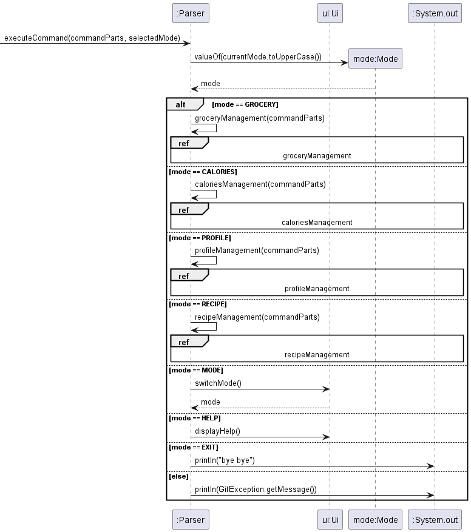
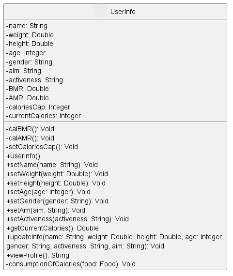
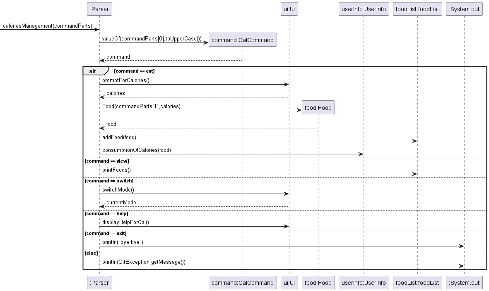
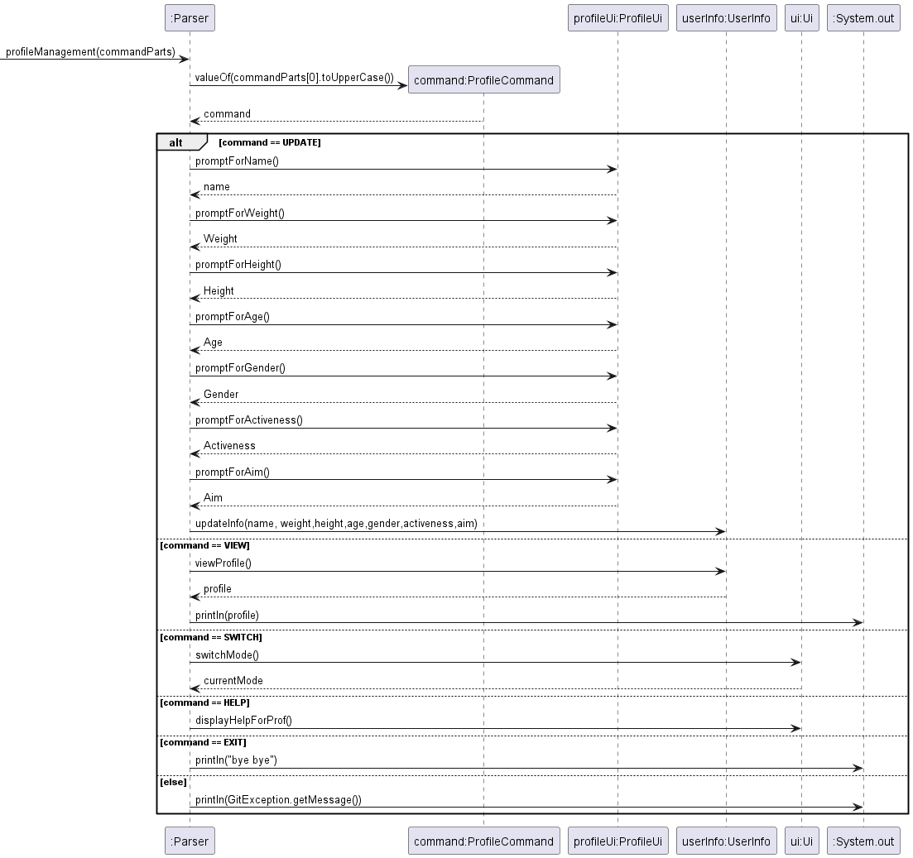
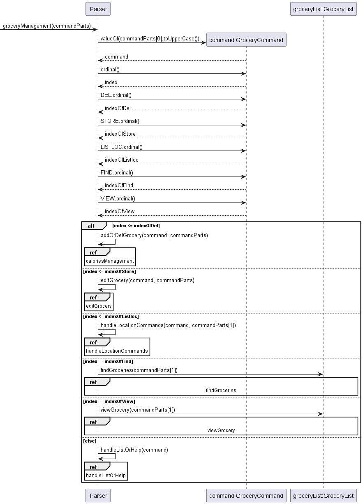
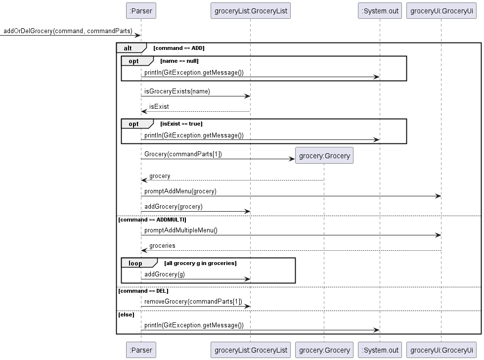
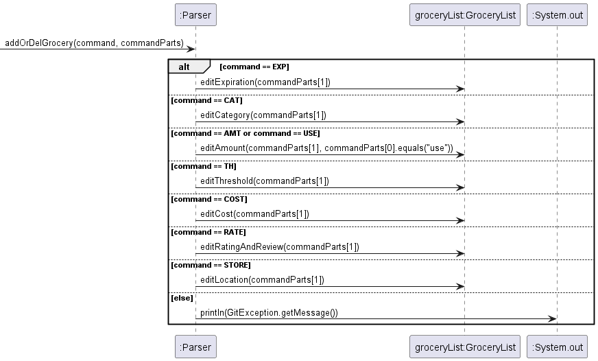
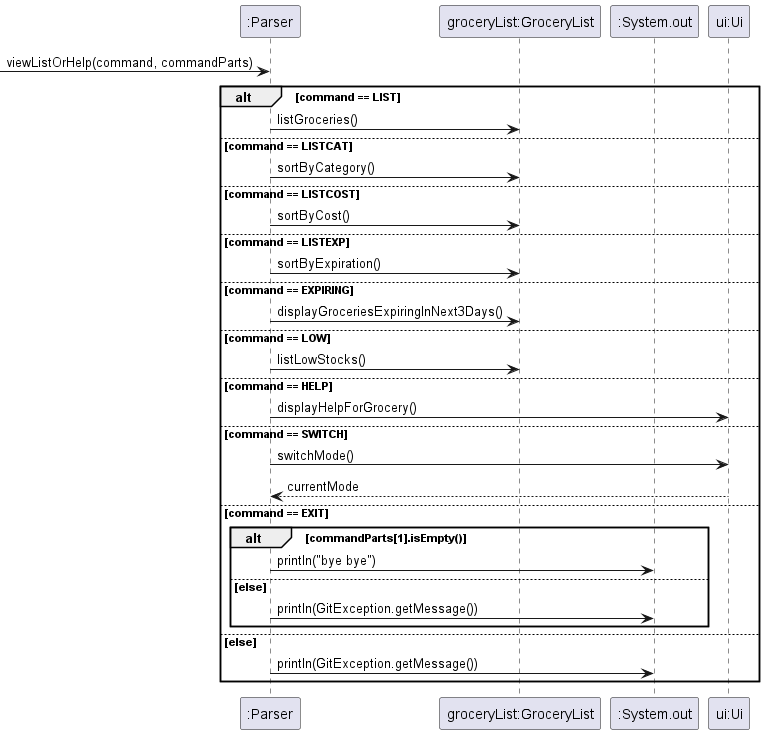
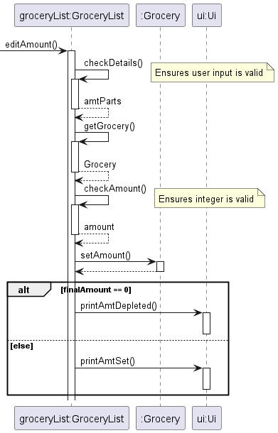

# Developer Guide

## Acknowledgements

{list here sources of all reused/adapted ideas, code, documentation, and third-party libraries -- include links to the original source as well}
This project makes use of several open-source software and libraries. We acknowledge and are grateful to the community for these contributions:

### Libraries

1. **JUnit 5 (Jupiter API and Engine)**  
   JUnit 5 is used for writing and running repeatable tests in Java. It's a fundamental part of our testing framework, ensuring our application functions as intended.
   - **Version**: 5.10.0
   - [JUnit 5 Documentation](https://junit.org/junit5/docs/current/user-guide/)

2. **Jakarta Mail (formerly JavaMail)**  
   Jakarta Mail API is used for constructing and sending emails directly from our application, which is critical for notification features.
   - **Version**: 2.0.1
   - [Jakarta Mail Documentation](https://eclipse-ee4j.github.io/mail/)

3. **JLine 3**  
   JLine 3 is a library for handling console input, improving the user interaction experience in command-line applications by providing features like line editing, history, or tab completion.
   - **Version**: 3.25.0
   - [JLine 3 GitHub Repository](https://github.com/jline/jline3)

### Tools

4. **Gradle Shadow Plugin**  
   The Gradle Shadow Plugin is used to create a single distributable JAR file containing all dependencies, simplifying deployment and execution.
   - **Version**: 7.1.2
   - [Gradle Shadow Plugin Documentation](https://imperceptiblethoughts.com/shadow/)

5. **Checkstyle**  
   Checkstyle is a development tool to help programmers write Java code that adheres to a coding standard. It automates the process of checking Java code, which is helpful in maintaining code quality.
   - **Version**: 10.2
   - [Checkstyle Documentation](https://checkstyle.sourceforge.io/)

### Development Environment

6. **Gradle**  
   Gradle is our chosen build automation tool which simplifies compiling, testing, and packaging the code.
   - [Gradle Documentation](https://gradle.org/guides/)

We would like to thank the developers and contributors of these projects for their efforts in maintaining such useful resources. Their hard work and dedication make software development more efficient and error-free.

## Design & implementation

{Describe the design and implementation of the product. Use UML diagrams and short code snippets where applicable.}

### _Designs_
### 1. Execute different commands based on the modes

* when 'executeCommand'  is executed in Parser, different methods in Parser will be self invoked based on the selected mode.
* if mode is `grocery`, execute `groceryManagement`
* if mode is `calories`, execute `caloriesManagement`
* if mode is `profile`, execute `profileManagement`
* if mode is `recipe`, execute `recipeManagement`

The following is a class diagram containing Food, FoodList and UserInfo

### 2. Calories Management Mode

   * when `caloriesManagement` is executed in Parser, different actions will be carried out based on the commands.
   * if `eat`, store the name and calories of the input food
   * if `view`, display all the foods consumed

### 3. Profile Management Mode

  * when `profileManagement` is executed in Parser, different actions will be carried out based on the commands.
  * if `update`, store the user data required for calories calculation.
  * if `view`, display user information

### 4. Grocery Management Mode

* different methods in Parser will be self invoked based on the index of the command in enum class GroceryCommand.

#### 4.1 addOrDelGrocery

To add a new grocery or delete an existing grocery.

#### 4.2 editGrocery

To edit the information of an existing grocery.

#### 4.3 viewListOrHelp

### 1. View all groceries added
   * First create a method in "Grocery" class that prints the grocery in a preferred format.\
     e.g., NAME, AMOUNT, EXPIRATION, PRICE.
   * Then create a method in "GroceryList" class that prints all the groceries in the list.

&nbsp;
### 2. List the groceries by price in descending order
   * First, create a field in "Grocery" class that stores the cost of a grocery.
   * When adding a grocery, prompt the user to enter the cost.
   * Format the cost into 2 decimal places, remove the dollar sign and store it as a string.
   * Second, the grocery's cost accordingly before adding it into the list.
   * When setting the cost, convert the cost from String into Double.
   * Third, add method in "GroceryList" class to create a copy of the current grocery list, then sort the 
   new grocery list by price using lambda function. Reverse and print the new list.

&nbsp;
### 3. Input category for each grocery added
   * In Grocery class, modified the Grocery constructor to accept the 'category' parameter.
   * In Parser class executeCommand method, modified the add command to prompt the user for the category of the grocery. Passed the category as a parameter when creating a new Grocery object.
   * In Ui class, added a new method promptForCategory to prompt the user for the category of the grocery.
   * In Grocery class, modified the printGrocery method to include the category information in the output string.

&nbsp;
### 4. Input amount for each grocery added
   * In Grocery class, modified the Grocery constructor to accept the 'amount' parameter.
   * In Parser class executeCommand method, modified the add command to prompt the user for the amount of grocery. Passed the amount as a parameter when creating a new Grocery object.
   * In Ui class, added a new method promptForAmount to prompt the user for the amount of grocery.
   * In Grocery class, modified the printGrocery method to print different units of measurement for different categories.

&nbsp;
### 5. Input the location of where each grocery is stored
   * In Grocery class, modified the Grocery class to include location (String) as an attribute.
   * In Grocery class, modified the Grocery constructor to accept the 'location' parameter.
   * In Grocery class, under printGrocery, added locationString to format location.
   * In Parser class executeCommand method, modified the add command to prompt the user for where the grocery is stored. Passed the location as a parameter when creating a new Grocery object.
   * In Ui class, added promptForLocation method to take in user input for location of the grocery.
   * In Ui class, modified the printGrocery method to print the 'location' of the grocery alongside the grocery name.
   * Alternative considered: Can possibly add location as enumeration however different people might store groceries in different places thus better to set as String so that user is free to input location details however specific they want.

&nbsp;
### 6. Edit grocery amount after using a grocery
   * A `Grocery` stores its `amount` as an attribute. All `Grocery` objects are then stored in an ArrayList in `GroceryList`, which entirely handles the editing of the `amount`.

   * `GroceryList+editAmount()` is used to either decrease or directly set the `amount` of a `Grocery`. It takes in 2 parameters:
      1. details: String — User input read from `Scanner`.
      2. use: boolean — `true` decreases the `amount`, while `false` directly sets it.
   * To edit the `amount` after using a `Grocery`, the user inputs `use GROCERY a/AMOUNT`. 
Our app then executes `GroceryList+editAmount()` with parameter `use = true`, as illustrated by the following sequence diagram.

  * Additional checks specific to `use` ensure that the user only inputs a valid `int`, or that the `amount` must not be 0 beforehand.
  * Any exceptions thrown come with a message to help the user remedy their specific issue, as displayed by the `Ui`.

&nbsp;
### 7. Input expiration date of each grocery when added
   * In Grocery class, the expiration field in the Grocery class was changed from a String to a LocalDate to standardize date handling.
   * In Grocery class, the setExpiration method was updated to accept a String input, convert it to a LocalDate using a specified format ("yyyy-MM-dd"), and then store this date.
   * In UI class, the UI now includes a multi-step process to prompt the user for the year, month, and day of the grocery item's expiration date. This process ensures that the date is captured in a user-friendly manner and stored accurately.
   * In GroceryList class, a new method, sortByExpiration, was added to allow sorting the list of groceries by their expiration dates in ascending order. This method utilizes the Collections.sort method with a lambda expression comparing the expiration dates of Grocery items.

&nbsp;
### 8. Editing expiration date after it is added
   * In GroceryList class, modified the editExpiration method to parse String into localdate.
    * `GroceryList+editExpiration()` is used to directly set the `exp` of a `Grocery`. It takes in 1 parameter:
      1. details: String — User input read from `Scanner`.
   * To edit the `exp` after using a `Grocery`, the user inputs `use GROCERY d/EXPIRATION_DATE`. 

## Product scope
### Target user profile

Our target user is someone who regularly goes grocery shopping, and would like to track and manage their inventory of groceries.

### Value proposition

Grocery in Time aims to act as an easy-to-use central database for all the user's groceries. Managing many groceries stored at different locations around the house can get confusing,
therefore our app will allow users to track their groceries easily. 

Users are able to edit and manage the category, amount, expiration date, and storage location of their groceries.
When groceries are running low, the app can generate a shopping list to remind users of what they need to buy.
Furthermore, the app can generate a list of items that are expiring soon, reminding users to consume their groceries as soon as possible.

## User Stories

| Version | As a ...                      | I want to ...                               | So that I can ...                                       |
|---------|-------------------------------|---------------------------------------------|---------------------------------------------------------|
| v1.0    | new user                      | see instructions on how to use the app      | refer to them when I forget how to use the application  |
| v1.0    | user                          | add groceries to the app                    | manage all my groceries                                 |
| v1.0    | user                          | view all my groceries                       | know what I have bought                                 |
| v1.0    | user                          | delete groceries from the list              | stop tracking those groceries                           |
| v1.0    | user                          | add the amount of a grocery                 | keep track of the amount of that item I have            |
| v1.0    | user                          | add the expiration date of the grocery      | keep track of when my items expire easily               |
| v2.0    | financially-aware user        | add the cost of the groceries               | know how much I am spending                             |
| v2.0    | health-conscious user         | categorise my groceries                     | know what types of groceries I have                     |
| v2.0    | user with many storage spaces | add the location of where an item is stored | see where I keep my groceries                           |
| v2.0    | user who consumes groceries   | track the usage of my groceries             | know how much I have left                               |
| v2.0    | user who replenishes groceries| set threshold amount for the groceries      | know what groceries I should top up                     |
| v2.0    | user who cooks with recipes   | create and keep my own version of recipes   | refer to my own recipes when I cook                     |
| v2.0    | health-conscious user         | store the calories of the food I consumed   | track my calories intake and know how much I should eat |

## Non-Functional Requirements

{Give non-functional requirements}

## Glossary

* *glossary item* - Definition

## Instructions for manual testing

{Give instructions on how to do a manual product testing e.g., how to load sample data to be used for testing}
