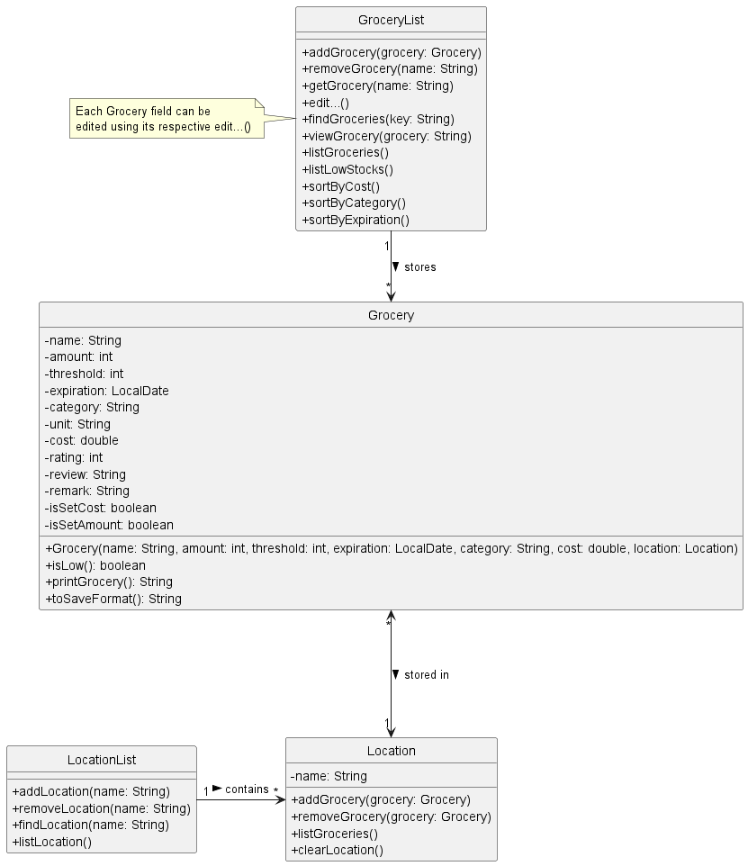
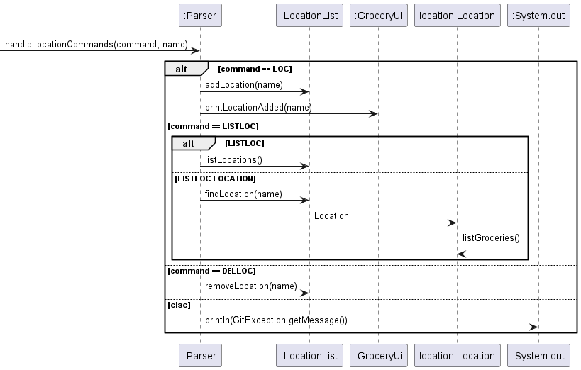
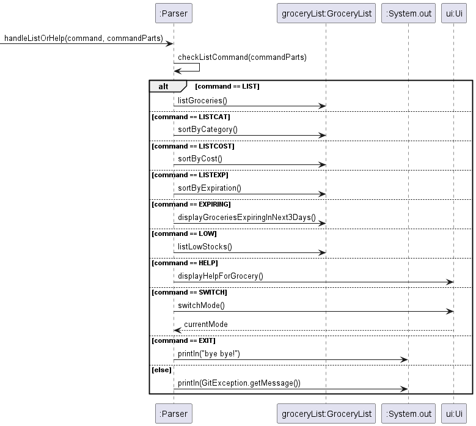
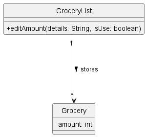
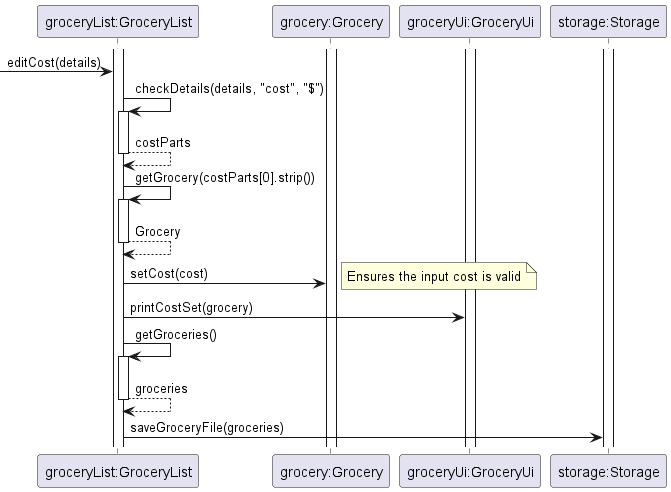
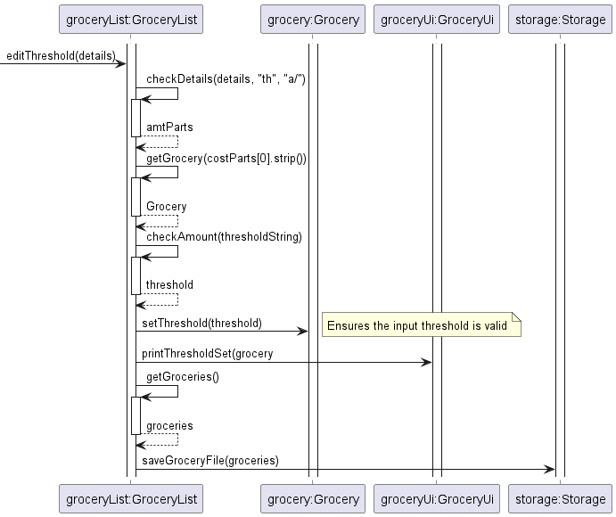
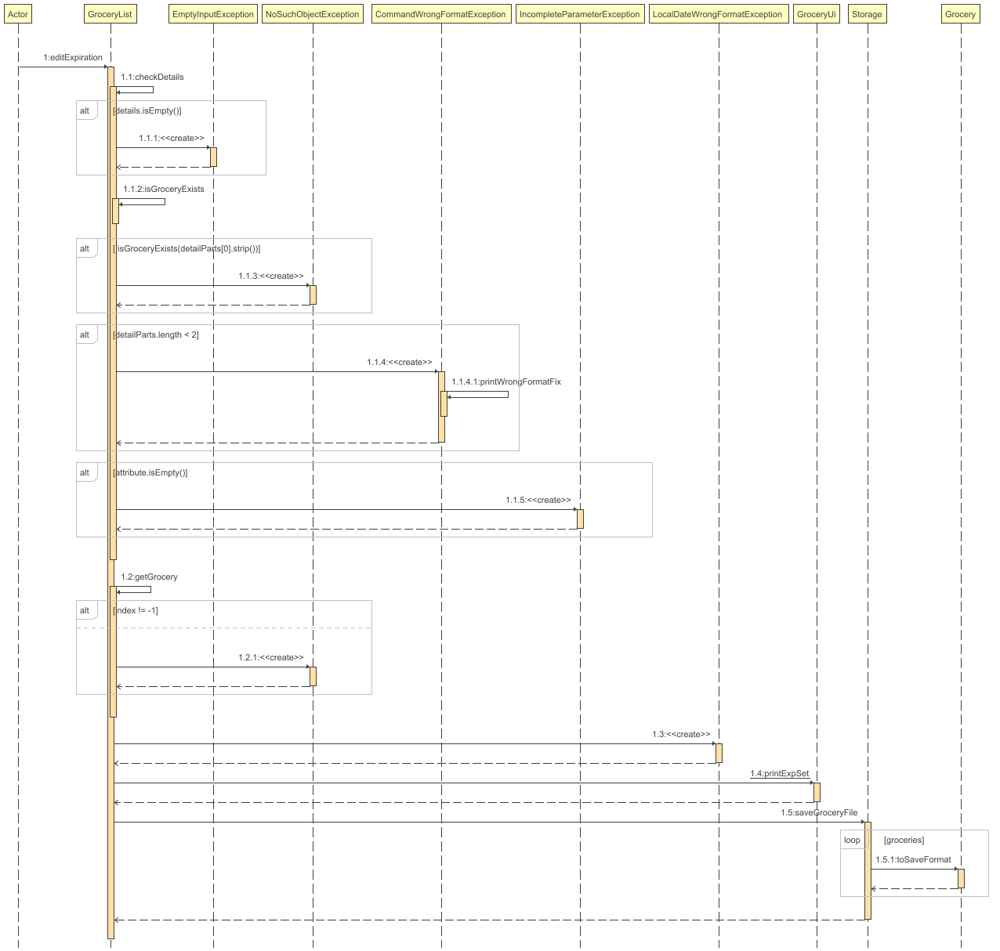
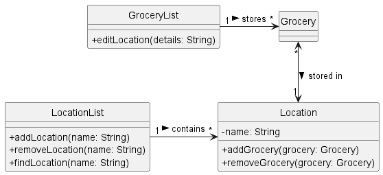
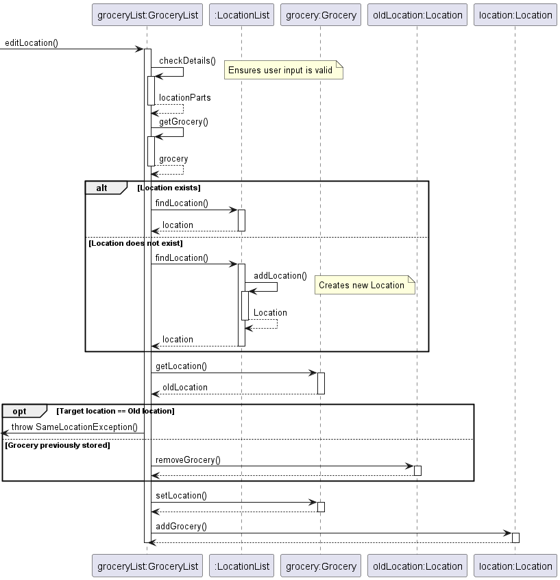

# Developer Guide

- [Acknowledgements](#acknowledgements)
- [Design & Implementation](#design--implementation)
  - [Designs](#_designs_)
    - [1. Execute different commands based on the modes](#1-execute-different-commands-based-on-the-modes)
    - [2. Calories Management Mode](#2-calories-management-mode)
    - [3. Profile Management Mode](#3-profile-management-mode)
    - [4. Grocery Management Mode](#4-grocery-management-mode)
      - [4.1 addOrDelGrocery](#41-addordelgrocery)
      - [4.2 editGrocery](#42-editgrocery)
      - [4.3 handleLocationCommands](#43-handlelocationcommands)
      - [4.4 handleListOrHelp](#44-handlelistorhelp)
  - [Implementation](#_implementation_)
    - [1. View all groceries added](#1-view-all-groceries-added)
    - [2. List the groceries by price in descending order](#2-list-the-groceries-by-price-in-descending-order)
    - [3. Input category for each grocery added](#3-input-category-for-each-grocery-added)
    - [4. Input amount for each grocery added](#4-input-amount-for-each-grocery-added)
    - [5. Input the location of where each grocery is stored](#5-input-the-location-of-where-each-grocery-is-stored)
    - [6. Edit grocery amount](#6-edit-grocery-amount)
    - [7. Edit the cost of a grocery after adding](#7-edit-the-cost-of-a-grocery-after-adding)
    - [8. Edit the threshold amount of a grocery after adding](#8-edit-the-threshold-amount-of-a-grocery-after-adding)
    - [9. View a list of groceries low in stock](#9-view-a-list-of-groceries-low-in-stock)
    - [10. Input expiration date of each grocery when added](#10-input-expiration-date-of-each-grocery-when-added)
    - [11. Editing expiration date after it is added](#11-editing-expiration-date-after-it-is-added)
    - [12. Storing a grocery in a storage location](#12-storing-a-grocery-in-a-storage-location)
- [Product Scope](#product-scope)
  - [Target user profile](#target-user-profile)
  - [Target user profile](#value-proposition)
- [User Stories](#user-stories)
- [Non-functional Requirements](#non-functional-requirements)
- [Glossary](#glossary)
- [Instructions for manual testing](#instructions-for-manual-testing)

## Acknowledgements

Grocery in Time (GiT) makes use of several open-source software and libraries. We acknowledge and are grateful to the community for these contributions:

### Libraries

1. **JUnit 5 (Jupiter API and Engine)**  
   JUnit 5 is used for writing and running repeatable tests in Java. It's a fundamental part of our testing framework, ensuring our application functions as intended.
   - **Version**: 5.10.0
   - [JUnit 5 Documentation](https://junit.org/junit5/docs/current/user-guide/)

2. **Jakarta Mail (formerly JavaMail)**  
   Jakarta Mail API is used for constructing and sending emails directly from our application, which is critical for notification features.
   - **Version**: 2.0.1
   - [Jakarta Mail Documentation](https://eclipse-ee4j.github.io/mail/)

3. **JLine 3**  
   JLine 3 is a library for handling console input, improving the user interaction experience in command-line applications by providing features like line editing, history, or tab completion.
   - **Version**: 3.25.0
   - [JLine 3 GitHub Repository](https://github.com/jline/jline3)

### Tools

4. **Gradle Shadow Plugin**  
   The Gradle Shadow Plugin is used to create a single distributable JAR file containing all dependencies, simplifying deployment and execution.
   - **Version**: 7.1.2
   - [Gradle Shadow Plugin Documentation](https://imperceptiblethoughts.com/shadow/)

5. **Checkstyle**  
   Checkstyle is a development tool to help programmers write Java code that adheres to a coding standard. It automates the process of checking Java code, which is helpful in maintaining code quality.
   - **Version**: 10.2
   - [Checkstyle Documentation](https://checkstyle.sourceforge.io/)

### Development Environment

6. **Gradle**  
   Gradle is our chosen build automation tool which simplifies compiling, testing, and packaging the code.
   - [Gradle Documentation](https://gradle.org/guides/)

We would like to thank the developers and contributors of these projects for their efforts in maintaining such useful resources. Their hard work and dedication make software development more efficient and error-free.

## Design & Implementation

## _Designs_
### 1. Execute different commands based on the modes

* When `executeCommand`  is executed in `Parser`, different methods will be self invoked based on the selected mode.
  * If mode is `grocery`, execute `groceryManagement`.
  * If mode is `calories`, execute `caloriesManagement`.
  * If mode is `profile`, execute `profileManagement`.
  * If mode is `recipe`, execute `recipeManagement`.

The following is a class diagram containing Food, FoodList and UserInfo.

### 2. Calories Management Mode

* When `caloriesManagement` is executed in `Parser`, different actions will be carried out based on the commands.
   * If `eat`, store the name and calories of the input food.
   * If `view`, display all the foods consumed.

### 3. Profile Management Mode

* When `profileManagement` is executed in `Parser`, different actions will be carried out based on the commands.
  * If `update`, store the user data required for calories calculation.
  * If `view`, display user information.

### 4. Grocery Management Mode

Below is a class diagram showing the associations between the `Grocery`, `GroceryList`, `Location`, and `LocationList` classes.

When `Parser` gets a user input related to the Grocery Management Mode, it executes `Parser-groceryManagement(commandPanrts)`.

Different methods in `Parser` will be self invoked based on the index of the command in enum class GroceryCommand.

#### 4.1 addOrDelGrocery

To add groceries or delete an existing grocery.

#### 4.2 editGrocery

To edit the information of an existing grocery.

#### 4.3 handleLocationCommands

`LOC` and `DELLOC` adds and deletes storage locations. 
`LISTLOC [LOCATION]` shows all locations or groceries at a given location, depending on whether a location was passed.

#### 4.4 handleListOrHelp

To list groceries according to different parameters, view help, switch modes, or exit from GiT.

&nbsp;
## _Implementation_

### 1. View all groceries added
   * When the command entered is `list`, `listGroceries()` in GroceryList will be executed.
   * If the current grocery list, `groceries`, is empty, execute `printNoGrocery()` in GroceryUi.
   * Else, execute `printGroceryList(groceries)` in GroceryUi.

### 2. List the groceries by price in descending order
   * When the command entered is `listcost`, `sortByCost()` in GroceryList will be executed.
   * If the current grocery list, `groceries`, is empty, execute `printNoGrocery()` in GroceryUi.
   * Else, create a new array list name `groceriesByCost` with type `Grocery`.
   * Assign all the values in current grocery list `groceries` to `groceriesByCost`.
   * Execute `sort` in `groceriesByCost` with a lambda function that compares the `getCost()` value of each Grocery in the list.
   * Then execute `Collections.reverse(groceriesByCost)` to reverse the list so that the cost is sorted in descending order.
   * Lastly, execute `printGroceryList(groceriesByCost)` in GroceryUi.

### 3. Input category for each grocery added
   * In Grocery class, modified the Grocery constructor to accept the 'category' parameter.
   * In Parser class executeCommand method, modified the add command to prompt the user for the category of the grocery. Passed the category as a parameter when creating a new Grocery object.
   * In Ui class, added a new method promptForCategory to prompt the user for the category of the grocery.
   * In Grocery class, modified the printGrocery method to include the category information in the output string.

### 4. Input amount for each grocery added
   * In Grocery class, modified the Grocery constructor to accept the 'amount' parameter.
   * In Parser class executeCommand method, modified the add command to prompt the user for the amount of grocery. Passed the amount as a parameter when creating a new Grocery object.
   * In Ui class, added a new method promptForAmount to prompt the user for the amount of grocery.
   * In Grocery class, modified the printGrocery method to print different units of measurement for different categories.

### 5. Input the location of where each grocery is stored
   * In Grocery class, modified the Grocery class to include location (String) as an attribute.
   * In Grocery class, modified the Grocery constructor to accept the 'location' parameter.
   * In Grocery class, under printGrocery, added locationString to format location.
   * In Parser class executeCommand method, modified the add command to prompt the user for where the grocery is stored. Passed the location as a parameter when creating a new Grocery object.
   * In Ui class, added promptForLocation method to take in user input for location of the grocery.
   * In Ui class, modified the printGrocery method to print the 'location' of the grocery alongside the grocery name.
   * Alternative considered: Can possibly add location as enumeration however different people might store groceries in different places thus better to set as String so that user is free to input location details however specific they want.

### 6. Edit grocery amount
   * A `Grocery` stores its `amount` as an attribute. All `Grocery` objects are then stored in an ArrayList in `GroceryList`, which entirely handles the editing of the `amount`.

   * `GroceryList+editAmount()` is used to either decrease or directly set the `amount` of a `Grocery`. It takes in 2 parameters:
      1. details: String — User input read from `Scanner`.
      2. isUse: boolean — `false` directly sets the `amount`, while `true` decreases it
   * To set the `amount` of a `Grocery`, the user inputs `amt GROCERY a/AMOUNT`.
   * To edit the `amount` after using a `Grocery`, the user inputs `use GROCERY a/AMOUNT`.
   * Our app then executes `GroceryList+editAmount()` with parameter `use = false` or `true` respectively, as illustrated by the following sequence diagram.

  * Additional checks specific to `use` ensure that the user only inputs a valid `int`, or that the `amount` must not be 0 beforehand.
  * Any exceptions thrown come with a message to help the user remedy their specific issue, as displayed by the `Ui`.

### 7. Edit the cost of a grocery after adding
* when the command entered is `cost`, `editCost` in GroceryList will be executed.
  
* Additional checks ensure that the user only inputs a valid `positive numeric` value.
* Any exceptions thrown come with a message to help the user remedy their specific issue, as displayed by the `Ui`.

### 8. Edit the threshold amount of a grocery after adding
* when the command entered is `th`, `editThreshold` in GroceryList will be executed.
  
* Additional checks ensure that the user only inputs a valid `positive integer`.
* Any exceptions thrown come with a message to help the user remedy their specific issue, as displayed by the `Ui`.

### 9. View a list of groceries low in stock
* When the command entered is `low`, `listLowStocks` in GroceryList will be executed.
* This will create a new array list called `lowStockGroceries` with type `Grocery`
* For each grocery in the current grocery list, `groceries`, execute `grocery.isLow()`. Add the grocery into `lowStockGroceries` if the return value is true.
* Execute `printLowStocks(lowStockGroceries)` in GroceryUi to print out the list.

### 10. Input expiration date of each grocery when added
   * In Grocery class, the expiration field in the Grocery class was changed from a String to a LocalDate to standardize date handling.
   * In Grocery class, the setExpiration method was updated to accept a String input, convert it to a LocalDate using a specified format ("yyyy-MM-dd"), and then store this date.
   * In UI class, the UI now includes a multistep process to prompt the user for the year, month, and day of the grocery item's expiration date. This process ensures that the date is captured in a user-friendly manner and stored accurately.
   * In GroceryList class, a new method, sortByExpiration, was added to allow sorting the list of groceries by their expiration dates in ascending order. This method utilizes the Collections.sort method with a lambda expression comparing the expiration dates of Grocery items.

### 11. Editing expiration date after it is added
   * In GroceryList class, modified the editExpiration method to parse String into LocalDate.
    * `GroceryList+editExpiration()` is used to directly set the `exp` of a `Grocery`. It takes in 1 parameter:
      1. details: String — User input read from `Scanner`.
   * To edit the `exp` after using a `Grocery`, the user inputs `use GROCERY d/EXPIRATION_DATE`.

### 12. Storing a grocery in a storage location
* A `Grocery` stores its location by referencing a `Location` object. All `Locations` are stored in a `LocationList` class.
    

    
* `GroceryList+editLocation()` handles the editing of a grocery's location.
  1. If the grocery is not stored anywhere, its `Location` will be set.
  2. If the grocery is to be stored in a different location, its `Location` will be changed.
*  This method takes in 1 parameter:
    1. details: String — User input read from `Scanner`.
* The user enters `store GROCERY l/LOCATION` to store the grocery in the desired location. Our app then executes `GroceryList+editLocation()`, as illustrated by the following sequence diagram.
    

* If the target `Location` does not exist, our app automatically creates it and stores the grocery there.
* If the target `Location` is the same as the current `Location`, our app throws a `SameLocationException()`, informing the user of this error.

&nbsp;
## Product Scope
### Target user profile

Our target user is someone who regularly goes grocery shopping, and would like to track and manage their inventory of groceries. 
Our target user is also health-conscious and interested in keeping track of their calorie consumption. 
Additionally, other than grocery shopping, our target user will likely be cooking as well, thus they will want to create and management their own recipes.

### Value proposition

Grocery in Time aims to act as an easy-to-use central database for all the user's groceries. Managing many groceries stored at different locations around the house can get confusing,
therefore our app will allow users to track their groceries easily. 

Users are able to edit and manage the category, amount, expiration date, and storage location of their groceries.
When groceries are running low, the app can generate a shopping list to remind users of what they need to buy.
Furthermore, the app can generate a list of items that are expiring soon, reminding users to consume their groceries as soon as possible.

GiT also comes with other modes for recipe management, profile management and calorie tracking.

In recipe management mode, users will be able to create and record their own recipes with details such as title, ingredients and steps.
User will be able to look for recipes using a keyword, view and edit existing recipes. 
In profile management mode, users can store information such as weight, height and gender to calculate and manage their calories intake according to their goals.
Lastly, in calorie tracker, users can add the food they have eaten along with the calories for the GiT to calculate user's total intake.

## User Stories

| Version | As a ...                       | I want to ...                                       | So that I can ...                                       |
|---------|--------------------------------|-----------------------------------------------------|---------------------------------------------------------|
| v1.0    | new user                       | see instructions on how to use the app              | refer to them when I forget how to use the application  |
| v1.0    | user                           | add groceries to the app                            | manage all my groceries                                 |
| v1.0    | user                           | view all my groceries                               | know what I have bought                                 |
| v1.0    | user                           | delete groceries from the list                      | stop tracking those groceries                           |
| v1.0    | user                           | add the amount of a grocery                         | keep track of the amount of that item I have            |
| v1.0    | user                           | add the expiration date of the grocery              | keep track of when my items expire easily               |
| v2.0    | user who consumes groceries    | track the usage of my groceries                     | know how much I have left                               |
| v2.0    | financially-aware user         | track and view the cost of my groceries             | know how much I am spending                             |
| v2.0    | health-conscious user          | categorise my groceries                             | know what types of groceries I have                     |
| v2.0    | user with many storage spaces  | add the location of where an item is stored         | see where I keep my groceries                           |
| v2.0    | user with many storage spaces  | find out what groceries are stored in each location | know where to find my groceries                         |
| v2.0    | forgetful user                 | get a list of groceries that are low in stock       | remind myself to buy them on my next grocery trip       |
| v2.0    | forgetful user                 | find my groceries by name                           | know if I have tracked that grocery                     |
| v2.0    | user who replenishes groceries | set threshold amount for the groceries              | know what groceries I should top up                     |
| v2.0    | user who cooks with recipes    | create and keep my own version of recipes           | refer to my own recipes when I cook                     |
| v2.0    | user who cooks with recipes    | list all my recipes                                 | know what recipes I have created                        |
| v2.0    | user who cooks with recipes    | view all the details of a recipe                    | use the recipe to recreate the dish                     |
| v2.0    | user who cook with recipes     | delete a recipe                                     | remove recipes I no longer want                         |
| v2.0    | health-conscious user          | store the calories of the food I consumed           | track my calories intake and know how much I should eat |
| v2.0    | environmentally-conscious user | get a list of items that are expiring soon          | prioritise using them to reduce food waste              |
| v2.0    | reviewer                       | rate and review products                            | know if I like them                                     |
| v2.0    | meticulous user                | add remarks to my groceries                         | know extra information about my groceries               |
| v2.1    | user who cooks with recipes    | edit my old recipes                                 | update the recipes to new preferences and methods       |
| v2.1    | user                           | store my past grocery information                   | access information about the groceries I am tracking    |

## Non-Functional Requirements

* GiT is able to handle large amounts of data, stored in `/data/groceryList.txt`.
* GiT should be easy for a new user to grasp, and allow experienced users to use different functionalities quickly.

## Glossary

* *Java* - Object-oriented programming language used to create Grocery in Time.
* *Command Line Interface* - Text-based user interface to allow users to interact with Grocery in Time.

## Instructions for manual testing

First, testers can install GiT by following these instructions:

1. Ensure that you have Java 11 or above installed.
2. Down the latest version of `Grocery in Time` from [here](https://github.com/AY2324S2-CS2113-T12-2/tp/releases).
3. Open a command terminal, `cd` into the folder where the JAR file is
   and use `java -jar Git.jar` to run Grocery in Time.

To get you started, we have provided some sample data [here](https://github.com/AY2324S2-CS2113-T12-2/tp/tree/master/sampleData).
To load this data into GiT, simply move `groceryList.txt` into the `/data` directory that will be created in the same directory as `Git.jar` after running it at least once.

Do check out our [User Guide](UserGuide.md) to see what functionalities GiT offers. Happy testing!