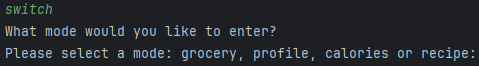
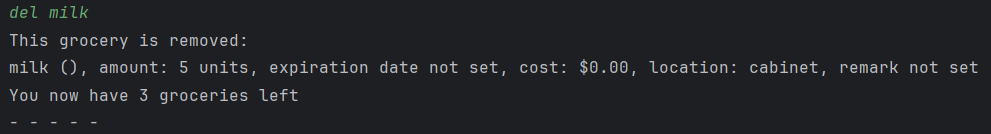
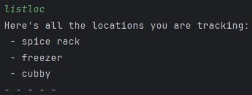
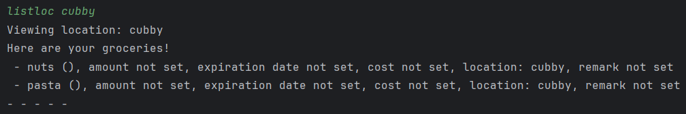

# User Guide to ***Grocery in Time***


## Introduction

Grocery in Time (GiT) is a **grocery tracker app**, optimised for use via a Command Line Interface (CLI).
It allows users to track and manage their groceries around their home easily.


- [Quick start](#quick-start)
- [Features](#features)
  - [Switching between different modes: `switch`](#switching-between-different-modes-switch)
  - [Grocery management mode](#grocery-management-mode)
    - [Add / Edit Grocery Commands](#add--edit-groceries)
      - [Adding a new grocery: `add`](#adding-a-new-grocery-add)
      - [Deleting a grocery: `del`](#deleting-a-grocery-del)
      - [Setting the expiration date of a grocery: `exp`](#setting-the-expiration-date-of-a-grocery-exp)
      - [Viewing groceries expiring in the next 3 days](#viewing-groceries-expiring-in-the-next-3-days-expiring)
      - [Setting the amount of a grocery: `amt`](#setting-the-amount-of-a-grocery-amt)
      - [Using a grocery: `use`](#using-a-grocery-use)
      - [Setting the cost of a grocery: `cost`](#setting-the-cost-of-a-grocery-cost)
      - [Setting the threshold of a grocery: `th`](#setting-the-threshold-of-a-grocery-th)
      - [Adding remark for a grocery: `remark`](#adding-a-remark-for-a-grocery-remark)
      - [Adding rating and review of a grocery: `rate`](#adding-rating-and-review-of-a-grocery-rate)
    - [View / List / Find grocery Commands](#view--list--find-groceries)
      - [View groceries that are low in stock: `low`](#viewing-groceries-that-are-low-in-stock-low)
      - [Finding groceries: `find`](#finding-groceries-find)
      - [Listing all groceries: `list`](#listing-all-groceries-list)
      - [Listing all groceries by price: `listcost`](#listing-all-groceries-by-price-listcost)
      - [Listing all groceries by expiration date: `listexp`](#listing-all-groceries-by-expiration-date-listexp)
      - [Listing storage locations and their groceries: `listloc`](#listing-storage-locations-and-their-groceries-listloc)
    - [Add / Edit Grocery Location Commands](#add--edit-grocery-location)
      - [Adding a storage location: `loc`](#adding-a-storage-location-loc)
      - [Storing a grocery in a storage location: `store`](#storing-a-grocery-in-a-storage-location-store)
      - [Removing a storage location: `delloc`](#removing-a-storage-location-delloc)
  - [Calories management mode](#calories-management-mode)
    - [Adding eaten food: `eat`](#adding-eaten-food-eat)
    - [Viewing all food and calories intake: `view`](#viewing-all-food-and-calories-intake-view)
  - [Profile management mode](#profile-management-mode)
    - [Updating user information: `update`](#updating-user-information-update)
    - [Viewing user details: `view`](#viewing-user-details-view)  
  - [Recipe management mode](#recipe-management-mode)
    - [Adding a new recipe: `add`](#adding-a-new-recipe-add)
    - [Listing all recipes: `list`](#listing-all-recipes-list)
    - [Viewing a recipe: `view`](#viewing-a-recipe-view)
    - [Deleting a recipe: `delete`](#deleting-a-recipe-delete)
- [FAQ](#faq)
- [Command summary](#command-summary)

## Quick Start
1. Ensure that you have Java 11 or above installed.
2. Down the latest version of `Grocery in Time` from [here](https://github.com/AY2324S2-CS2113-T12-2/tp/releases).
3. Open a command terminal, `cd` into the folder where the JAR file is
   and use `java -jar Git.jar` to run Grocery in Time.

&nbsp;
## Features

> #### Notes about the command format
> * Words in `UPPERCASE` are parameters to be supplied by the user.
> <br> e.g. In `find KEYWORD`, `KEYWORD` is a parameter to be supplied: `find cheese`.
> * Do not use command words / tag to name grocery / recipe etc. 
> <br> e.g. Do not name grocery "a/". 

## Switching between different modes: `switch`
Switches between profile, calories, grocery or recipe mode.
GiT comes in different modes and will prompt the user to choose their desired mode.

Format: `switch`

* Enter the desired mode to switch to after inputting `switch`.

Example of usage:

`switch`



&nbsp;
## Grocery management mode

> #### Notes about this mode
> * Features requiring the `GROCERY` or `LOCATION` inputs are case-insensitive.
> <br> e.g. `amt GROCERY a/AMOUNT` will set the amount of `milk` or `MILK`.
> <br> e.g. `store GROCERY l/LOCATION` works the same using `freezer` or `FREEZER`.

## Add / Edit Groceries Commands

### Adding a new grocery: `add`
Adds a grocery and any desired additional details.

Format: `add GROCERY`

* `GROCERY` must be a valid String.
* Duplicate groceries will not be added.
* After executing `add GROCERY`, GiT will ask if the user wishes to include additional details.
  * If so, the user has to enter the numbers corresponding to the details they wish to add.
  * Multiple numbers can be entered in any order and spaces between numbers are ignored.
  * Details are prompted for in the order their numbers are entered.
  * If `8` is entered, another menu explaining what each detail means will always be displayed first.
  * Invalid values are ignored.
  * This step can be skipped by inputting nothing.
* Any details not included here can be edited using other commands in the future.

Example of usage :
```
>> add milk

Before adding milk, do you want to include the following details?
1. Category
2. Amount
3. Location
4. Expiration Date
5. Cost
6. Threshold Amount
7. Remark
8. Help
Please enter the number of the details you want to include:
You may enter multiple numbers. (e.g. 1234)
To skip this step, do not enter any values.

>> 23

Including Amount
Please enter the amount (e.g. 3):

>> 5

- - - - -
Including Location
Please enter the location (e.g. freezer first compartment)

>> cabinet

- - - - -
milk added!
- - - - -
```


&nbsp;
### Deleting a grocery: `del`
Delete a grocery.

Format: `del GROCERY`

* If the `GROCERY` was stored in a location, it would be removed from that location.

Example of usage:

`del milk`

```
>> del milk

This grocery is removed
```



&nbsp;
### Setting the expiration date of a grocery: `exp`
Sets the expiration date of a grocery.

Format: `exp GROCERY d/EXPIRATION_DATE`

* `EXPIRATION_DATE` must be a in yyyy-MM-dd format.

Example of usage:

`exp milk d/2024-07-20`


&nbsp;
### Viewing groceries expiring in the next 3 days: `expiring`
Shows a list of groceries that are expiring in the next 3 days.

Format: `expiring`

Example of usage:

`expiring`


&nbsp;
### Setting the amount of a grocery: `amt`
Sets the amount of a grocery.

Format: `amt GROCERY a/AMOUNT`

* `AMOUNT` must be a valid integer.

Example of usage:

`amt milk a/5`


&nbsp;
### Using a grocery: `use`
Reduce the amount of a grocery after using it.

Format: `use GROCERY a/AMOUNT`

* `AMOUNT` must be a valid integer.
* If `AMOUNT` is greater than what the `GROCERY` has in stock, its amount will be reduced to 0.
* If the amount of the `GROCERY` is already 0, GiT will let the user know and the amount stays at 0.

Example of usage:

* `use meat a/4`

  

* `use meat a/60` - amount used is greater than what is in stock.

  


&nbsp;
### Setting the cost of a grocery: `cost`
Sets the cost of a grocery.

Format: `cost GROCERY  $PRICE`

* `PRICE` must be a valid numerical value.

Example of usage:

`cost milk $1.20`


&nbsp;
### Setting the threshold of a grocery: `th`
Sets the threshold amount of a grocery.  
The user should be reminded to top up the stock if amount falls below the threshold amount.

Format: `th GROCERY a/AMOUNT`

* `AMOUNT` must be a valid integer.

Example of usage:

`th milk a/1`

&nbsp;
### Adding a remark for a grocery: `remark`
Adds a remark for existing grocery.  
The remark for the grocery will be displayed in `list` and `view`.

Format: `remark GROCERY r/REMARK`

Example of usage:
`remark milk r/save some for next week`

&nbsp;
### Adding rating and review of a grocery: `rate`
Adds rating and review of an existing grocery

Format: `rate GROCERY`

Example of usage:

`rate milk`

## View / List / Find Grocery Commands

&nbsp;
### Viewing a grocery: `view`
Shows all the details of the grocery.

Format: `view GROCERY`

Example of usage:
```
view apple
These are the details of fuji apple:
Amount: 5
Expiry date: not set
Category: Fruit
Cost: not set
Location: Fridge
Rating: 4
Review: buy the same brand next time
Remark: not set
```

&nbsp;
### Viewing groceries that are low in stock: `low`
Shows a list of groceries below the threshold amount.

Format: `low`

Example of usage:

`low`

&nbsp;
### Finding groceries: `find`
Find groceries containing a given keyword in their name.

Format: `find KEYWORD`

* The search is case-insensitive.
* If a phrase is passed, the entire phrase is searched for.

Example of usage:

`find cheese`


&nbsp;
### Presenting all expiring groceries: `expiring`
Show all the expiring groceries and send email notification if needed.

Foramt: `expiring`

Example of usage:

```
expiring
Checking for groceries nearing expiration...   
Milk is nearing expiration on 2024-04-10       
Do you wish to send a notification email? (y/n)
y
Please enter your email to receive notifications:
example@gamil.com
Sending notification email...
Email sent successfully to example@gmail.com
```

&nbsp;
### Listing all groceries: `list`
Shows a list of all groceries you have.

Format: `list`

Example of usage:

`list`

&nbsp;
### Listing all groceries by price: `listcost`
Shows a list of all groceries you have, sorted by price.

Format: `listcost`

Example of usage:

`listcost`

&nbsp;
### Listing all groceries by expiration date: `listexp`
Shows a list of all groceries you have, sorted by expiration date.

Format: `listexp`

Example of usage:

`listexp`

&nbsp;
### Listing storage locations and their groceries: `listloc`
View all storage locations being tracked, or the groceries stored in a given location

Format: `listloc [LOCATION]`

* `LOCATION` is an optional parameter.
* Without `LOCATION`, all storage locations will be displayed.
* With `LOCATION`, all groceries in the given `LOCATION` will be displayed

Example of usage:

* `listloc`

  

* `listloc cubby`

  

## Add / Edit Grocery Location Commands

&nbsp;
### Adding a storage location: `loc`
Add a storage location to be tracked.

Format: `loc LOCATION`

* Duplicate locations will not be added.

Example of usage:

`loc freezer`


&nbsp;
### Storing a grocery in a storage location: `store`
Store a grocery in a given storage location.

Format: `store GROCERY l/LOCATION`

* If `LOCATION` does not exist, GiT will create the storage location and store the `GROCERY` there automatically.

Example of usage:

`store paprika l/spice rack`

* Location exists

  

* Location does not exist

  

&nbsp;
### Removing a storage location: `delloc`
Remove a storage location from tracking.

Format: `delloc LOCATION`

Example of usage:

`delloc cabinet`


&nbsp;
## Calories management mode

### Adding eaten food: `eat`
Adds the food eaten and store its calories.

Format: `eat FOOD`

Example of usage:

`eat burger`

&nbsp;
### Viewing all food and calories intake: `view`
Shows all the food consumed so far and their calories.

Format: `view`

Example of usage:

`view`


&nbsp;
## Profile management mode

### Updating user information: `update`
Stores information needed to calculate and manage calories intake.

Format: `update`

Example of usage:

`update`

&nbsp;
### Viewing user details: `view`
Shows the user profile details.

Format: `view`

Example of usage:

`view`


&nbsp;
## Recipe management mode

### Adding a new recipe: `add`
Adds new recipe, ingredient and steps.

Format: `add`

Example:
```
>> add

Please enter the title of the recipe:

>> Fried Egg

Please enter the ingredients for this recipe in one line:

>> egg, salt

Please enter the steps for this recipe in one line:

>> Fry the egg. Add salt. Serve.

Fried Egg added!
```

&nbsp;
### Listing all recipes: `list`
Shows all the recipe titles.

Format: `list`

Example:
```
>> list

Here are your recipe titles!

1. fried egg
- - - - -
```

&nbsp;
### Viewing a recipe: `view`
Shows the recipe ingredients and steps.

Format: `view` `RECIPE` 

Example:
```
>> view

Please enter the title of the recipe:

>> Fried Egg
```

&nbsp;
### Deleting a recipe: `delete`
Shows the recipe ingredients and steps.

Format: `delete` `RECIPE`

Example:
```
>> delete

Please enter the title of the recipe:

>> Fried Egg

Fried Egg is removed from the recipe list.
```

## FAQ

**Q**: How do I transfer my data to another computer? 

**A**: GiT's data is automatically saved under 

## Command Summary

### Switch between modes
| Command                                                        | Format                 |
|----------------------------------------------------------------|------------------------|
| Switch between modes                                           | `switch`               |


### Grocery management mode
| Command                                                      | Format                          |
|--------------------------------------------------------------|---------------------------------|
| Add grocery                                                  | `add GROCERY`                   |
| Delete grocery                                               | `del GROCERY`                   |
| Set grocery expiration date                                  | `exp GROCERY d/EXPIRATION_DATE` |
| View groceries expiring in the next 3 days                   | `expiring`                      |
| Set grocery amount                                           | `amt GROCERY a/AMOUNT`          |
| Use grocery                                                  | `use GROCERY a/AMOUNT`          |
| Set grocery cost                                             | `cost GROCERY $PRICE`           |
| Set grocery threshold amount                                 | `th GROCERY a/AMOUNT`           |
| Add or edit remark                                           | `remark GROCERY r/REMARK`       |
| Add grocery rating and review                                | `rate GROCERY`                  |
| Find groceries                                               | `find KEYWORD`                  |
| View groceries that are low in stock                         | `low`                           |
| Show all expiring groceries                                  | `expiring`                      |
| List groceries                                               | `list`                          |
| List groceries by price                                      | `listcost`                      |
| List groceries by expiration date                            | `listexp`                       |
| List storage locations <br> List groceries in given location | `listloc [LOCATION]`            |
| Add storage location                                         | `loc LOCATION`                  |
| Store grocery                                                | `store GROCERY l/LOCATION`      |
| Remove storage location                                      | `delloc LOCATION`               |


### Calorie management mode

| Command                          | Format     |
|----------------------------------|------------|
| Add eaten food                   | `eat FOOD` |
| View food and calories intake | `view`     |

### Profile management mode
| Command                 | Format   |
|-------------------------|----------|
| Update user information | `update` |
| View user details       | `view`   |

### Recipe management mode
| Command      | Format                              |
|--------------|-------------------------------------|
| Add recipe | `add` `TITLE` `INGREDIENTS` `STEPS` |
| List recipes | `list`                              |
| View recipe | `view` `TITLE`                      |
| Delete recipe | `delete` `TITLE`                    |