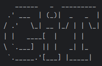

# User Guide to ***Grocery in Time***




## Introduction

Grocery in Time (GiT) is a **grocery tracker app**, optimised for use via a Command Line Interface (CLI).
It allows users to track and manage their groceries around their home easily.


- [Quick start](#quick-start)
- [Features](#features)
  - [Switching between different modes: `switch`](#switching-between-different-modes-switch)
  - [Grocery management mode](#grocery-management-mode)
    - [Viewing help: `help`](#viewing-help-help)
    - [Add / Edit / Delete Groceries](#add--edit--delete-groceries)
      - [Adding a new grocery: `add`](#adding-a-new-grocery-add)
      - [Adding multiple groceries: `addmulti`](#adding-multiple-groceries-addmulti)
      - [Setting the category of a grocery: `cat`](#setting-the-category-of-a-grocery-cat)
      - [Setting the amount of a grocery: `amt`](#setting-the-amount-of-a-grocery-amt)
      - [Using a grocery: `use`](#using-a-grocery-use)
      - [Storing a grocery in a storage location: `store`](#storing-a-grocery-in-a-storage-location-store)
      - [Setting the expiration date of a grocery: `exp`](#setting-the-expiration-date-of-a-grocery-exp)
      - [Setting the cost of a grocery: `cost`](#setting-the-cost-of-a-grocery-cost)
      - [Setting the threshold of a grocery: `th`](#setting-the-threshold-of-a-grocery-th)
      - [Adding a remark for a grocery: `remark`](#adding-a-remark-for-a-grocery-remark)
      - [Adding rating and review of a grocery: `rate`](#adding-rating-and-review-of-a-grocery-rate)
      - [Deleting a grocery: `del`](#deleting-a-grocery-del)
    - [Find / View / List Groceries](#find--view--list-groceries)
      - [Finding groceries: `find`](#finding-groceries-find)
      - [Viewing a grocery: `view`](#viewing-a-grocery-view)
      - [Viewing groceries that are low in stock: `low`](#viewing-groceries-that-are-low-in-stock-low)
      - [Viewing groceries expiring in the next 3 days: `expiring`](#viewing-groceries-expiring-in-the-next-3-days-expiring)
      - [Listing all groceries: `list`](#listing-all-groceries-list)
      - [Listing all groceries by category: `listcat`](#listing-all-groceries-by-category-listcat)
      - [Listing all groceries by price: `listcost`](#listing-all-groceries-by-price-listcost)
      - [Listing all groceries by expiration date: `listexp`](#listing-all-groceries-by-expiration-date-listexp)
      - [Listing storage locations and their groceries: `listloc`](#listing-storage-locations-and-their-groceries-listloc)
    - [Manage Storage Locations](#manage-storage-locations)
      - [Adding a storage location: `loc`](#adding-a-storage-location-loc)
      - [Removing a storage location: `delloc`](#removing-a-storage-location-delloc)
  - [Calories management mode](#calories-management-mode)
    - [Adding eaten food: `eat`](#adding-eaten-food-eat)
    - [Viewing all food and calories intake: `view`](#viewing-all-food-and-calories-intake-view)
  - [Profile management mode](#profile-management-mode)
    - [Updating user information: `update`](#updating-user-information-update)
    - [Viewing user details: `view`](#viewing-user-details-view)  
  - [Recipe management mode](#recipe-management-mode)
    - [Adding a new recipe: `add`](#adding-a-new-recipe-add)
    - [Listing all recipes: `list`](#listing-all-recipes-list)
    - [Viewing a recipe: `view`](#viewing-a-recipe-view)
    - [Finding recipe(s): `find`](#finding-recipes-find)
    - [Editing a recipe: `edit`](#editing-a-recipe-edit)
    - [Deleting a recipe: `delete`](#deleting-a-recipe-delete)
  - [Exiting the program: `exit`](#exiting-the-program-exit)
- [Data saving and loading](#data-saving-and-loading)
- [Command summary](#command-summary)

## Quick Start
1. Ensure that you have Java 11 or above installed.
2. Down the latest version of `Grocery in Time` from [here](https://github.com/AY2324S2-CS2113-T12-2/tp/releases).
3. Open a command terminal, `cd` into the folder where the JAR file is
   and use `java -jar Git.jar` to run Grocery in Time.

&nbsp;
# Features

> #### Notes about the command format
> * **Do not use command words / tag to name grocery / recipe etc.**
> <br> e.g. Do not name grocery "a/".
> * Words in `UPPERCASE` are parameters to be supplied by the user.
> <br> e.g. In `find KEYWORD`, `KEYWORD` is a parameter to be supplied: `find cheese`.

&nbsp;
## Switching between different modes: `switch`
Switches between profile, calories, grocery or recipe mode.
GiT comes in different modes and will prompt the user to choose their desired mode.

Format: `switch`

* No other word is to be entered after `switch`. Instead, wait for GiT to prompt you to enter the desired mode to switch to.

Example of usage:

```
>> switch

What mode would you like to enter?
Please select a mode: grocery, profile, calories or recipe:

>> grocery

Here are some ways you can maange your groceries!
...
```


&nbsp;
## Grocery management mode

> #### Notes about this mode
> * Features requiring the `GROCERY` or `LOCATION` inputs are case-insensitive.
> <br> e.g. `amt GROCERY a/AMOUNT` will set the amount of `milk` or `MILK`.
> <br> e.g. `store GROCERY l/LOCATION` works the same using `freezer` or `FREEZER`.
> * The actual output may differ slightly from the examples due to the addition of lines for better user readability.

### Viewing help: `help`
Prints all commands and a short description of what they do.

Format: `help`

* No other word is to be entered after `help`.

Example of usage:

```
>> help

Here are some ways you can manage your groceries!
...
```

&nbsp;
### Add / Edit / Delete Groceries

### Adding a new grocery: `add`
Adds a grocery and any desired additional details.

Format: `add GROCERY`

* `GROCERY` must be a valid String.
* Duplicate groceries will not be added.
* After executing `add GROCERY`, GiT will ask if the user wishes to include additional details.
  * If so, the user has to enter the numbers corresponding to the details they wish to add.
  * Multiple numbers can be entered in any order and spaces between numbers are ignored.
  * Details are prompted for in the order their numbers are entered.
  * If `8` is entered, another menu explaining what each detail means will always be displayed first.
  * Invalid values are ignored.
  * This step can be skipped by inputting nothing.
* Any details not included here can be edited using other commands.
  * The only detail can cannot be included here is the rating, which is edited using [rate](#adding-rating-and-review-of-a-grocery-rate).

Example of usage:
```
>> add milk

Before adding milk, do you want to include the following details?
1. Category
2. Amount
3. Location
4. Expiration Date
5. Cost
6. Threshold Amount
7. Remark
8. Help
Please enter the number of the details you want to include:
You may enter multiple numbers. (e.g. 1234)
To skip this step, do not enter any values.

>> 23

Including Amount
Please enter the amount (e.g. 3):

>> 5

Including Location
Please enter the location (e.g. freezer first compartment)

>> cabinet

milk added!
```


&nbsp;
### Adding multiple groceries: `addmulti`
Adds multiple groceries and any desired additional details.

Format: `addmulti`

* The grocery name cannot be empty.
* Duplicate groceries will not be added.
* After executing `addmulti`, GiT will prompt for various details.
  1. Number of groceries to add
  2. Additional details to include
     * The interface is the same as the one for [add](#adding-a-new-grocery-add).

Example of usage:

```
>> addmulti

How many groceries would you like to add?

>> 2

Adding item 1 of 2
Please enter the name of the grocery:

>> beans

Do you want to include additional details for beans? (Y/N)

>> Y

...
```


&nbsp;
### Setting the category of a grocery: `cat`
Sets the category of a grocery.

Format: `cat GROCERY c/CATEGORY`

* `CATEGORY` must be a valid String.
* `CATEGORY` will be stored in uppercase.

Example of usage:
```
>> cat milk c/dairy

milk is now a dairy
```


&nbsp;
### Setting the amount of a grocery: `amt`
Sets the amount of a grocery.

Format: `amt GROCERY a/AMOUNT`

* `AMOUNT` must be a valid integer.

Example of usage:
```
>> amt milk a/5

milk: 5
```


&nbsp;
### Using a grocery: `use`
Reduce the amount of a grocery after using it.

Format: `use GROCERY a/AMOUNT`

* `AMOUNT` must be a valid integer.
* If `AMOUNT` is greater than what the `GROCERY` has in stock, its amount will be reduced to 0.
* If the amount of the `GROCERY` is already 0, GiT will let the user know and the amount stays at 0.

Example of usage:

* Amount used is less than amount stored.

```
>> use meat a/4

meat: 56
```

* Amount used is greater than amount stored.

```
>> use meat a/60

meat is now out of stock!
```


&nbsp;
### Storing a grocery in a storage location: `store`
Store a grocery in a given storage location.

Format: `store GROCERY l/LOCATION`

* If `LOCATION` does not exist, GiT will create the storage location and store the `GROCERY` there automatically.
* More information on storage locations can be found [here](#manage-storage-locations).

Example of usage:

* `LOCATION` exists

```
>> store paprika l/spice rack

paprika stored in spice rack
```

* `LOCATION` does not exist

```
>> store onion l/cabinet

New location added: cabinet
onion stored in cabinet
```


&nbsp;
### Setting the expiration date of a grocery: `exp`
Sets the expiration date of a grocery.

Format: `exp GROCERY d/EXPIRATION_DATE`

* `EXPIRATION_DATE` must be in yyyy-MM-dd format.

Example of usage:

`exp milk d/2024-07-20`


&nbsp;
### Setting the cost of a grocery: `cost`
Sets the cost of a grocery.

Format: `cost GROCERY $PRICE`

* `PRICE` must be a valid numerical value.

Example of usage:

```
>> cost milk $1.20

milk is now $1.20
```


&nbsp;
### Setting the threshold of a grocery: `th`
Sets the threshold amount of a grocery.  
The user should be reminded to top up the stock if amount falls below the threshold amount.

Format: `th GROCERY a/AMOUNT`

* `AMOUNT` must be a valid integer.

Example of usage:

```
>> th milk a/1

milk's threshold is now 1
```


&nbsp;
### Adding a remark for a grocery: `remark`
Adds a remark for existing grocery.  
The remark for the grocery will be displayed in `list` and `view`.

Format: `remark GROCERY r/REMARK`

Example of usage:
`remark milk r/save some for next week`


&nbsp;
### Adding rating and review of a grocery: `rate`
Adds rating and review of an existing grocery

Format: `rate GROCERY`

Example of usage:

`rate milk`


&nbsp;
### Deleting a grocery: `del`
Delete a grocery.

Format: `del GROCERY`

* If the `GROCERY` was stored in a location, it would be removed from that location.

Example of usage:

```
>> del milk

This grocery is removed:
milk (dairy), amount: 0, expiration: 2024-04-10, cost: $0.00, location: fridge
You now have 2 groceries left
```

&nbsp;
## Find / View / List Groceries

### Finding groceries: `find`
Find groceries containing a given keyword in their name.

Format: `find KEYWORD`

* The search is case-insensitive.
* If a phrase is passed, the entire phrase is searched for.

Example of usage:

```
>> find cheese

Here are the groceries containg: cheese
- cheese (dairy), amount: 50
- red cheddar cheese (dairy), amount: 4
```


&nbsp;
### Viewing a grocery: `view`
Shows all the details of the grocery.

Format: `view GROCERY`

Example of usage:

```
>> view apple

These are the details of fuji apple:
Amount: 5
Expiry date: not set
Category: Fruit
Cost: not set
Location: Fridge
Rating: 4
Review: buy the same brand next time
Remark: not set
```


&nbsp;
### Viewing groceries that are low in stock: `low`
Shows a list of groceries below the threshold amount.

Format: `low`

* No other word is to be entered after `low`.

Example of usage:

```
>> low
Time to top up these groceries!
 - milk only left: 0
 - apple only left: 0
```


&nbsp;
### Viewing groceries expiring in the next 3 days: `expiring`
Shows a list of groceries that are expiring in the next 3 days. 
Sends an email notification if needed.

Format: `expiring`

* No other word is to be entered after `expiring`.

Example of usage:

```
>> expiring

Checking for groceries nearing expiration...   
Milk is nearing expiration on 2024-04-10       
Do you wish to send a notification email? (y/n)

>> y

Please enter your email to receive notifications:

>> example@gamil.com

Sending notification email...
Email sent successfully to example@gmail.com
```

&nbsp;
### Listing all groceries: `list`
Shows a list of all groceries you have.

Format: `list`

* No other word is to be entered after `list`.

Example of usage:

```
>> list

Here are your groceries!
 - coke (SODA), cost: $1.00
 - milk (DAIRY), amount: 0 units, cost: $1.20
 - apple (FRUIT), amount: 0 units, cost: $2.00
```


&nbsp;
### Listing all groceries by category: `listcat`
Shows a list of all groceries you have, sorted by category alphabetically.

Format: `listcat`

* No other word is to be entered after `listcat`.
* Grocery list is sorted, causing the order shown by `list` to change.

Example of usage:

```
>> listcat

Here are your groceries!
 - milk (DAIRY), amount: 0 units, cost: $1.20
 - apple (FRUIT), amount: 0 units, cost: $2.00
 - coke (SODA), cost: $1.00
```


&nbsp;
### Listing all groceries by price: `listcost`
Shows a list of all groceries you have, sorted by descending price.

Format: `listcost`

* No other word is to be entered after `listcost`.
* Grocery list is sorted, causing the order shown by `list` to change.

Example of usage:

```
>> listcost

Here are your groceries!
 - apple, amount: 0 units, cost: $2.00
 - milk, amount: 0 units, cost: $1.20
 - coke, cost: $1.00
```


&nbsp;
### Listing all groceries by expiration date: `listexp`
Shows a list of all groceries you have, sorted by expiration date
i.e. earliest expiring item at the top.

Format: `listexp`

* No other word is to be entered after `listexp`.
* Grocery list is sorted, causing the order shown by `list` to change.

Example of usage:

```
>> listexp

Here are your groceries!
 - meat (MEAT), expiration: 2024-04-10
 - cheese (DAIRY), expiration: 2025-12-12
```


&nbsp;
### Listing storage locations and their groceries: `listloc`
View all storage locations being tracked, or the groceries stored in a given location

Format: `listloc [LOCATION]`

* `LOCATION` is an optional parameter.
  * Without `LOCATION`, all storage locations will be displayed.
  * With `LOCATION`, all groceries in the given `LOCATION` will be displayed.
* More information on storage locations can be found [here](#manage-storage-locations).

Example of usage:

* `listloc`: All storage locations are displayed.

```
>> listloc

Here's all the locations you are tracking:
- spice rack
- freezer
- cubby
```

* `listloc cubby`: All groceries in `cubby` are displayed.

```
>> listloc cubby

Viewing location: cubby
Here are your groceries!
- cheese (dairy), amount: 50, location: cubby
- pasta (carbs), cost: $2.95, location: cubby
```


&nbsp;
## Manage Storage Locations

### Adding a storage location: `loc`
Add a storage location to be tracked.

Format: `loc LOCATION`

* Duplicate locations will not be added.

Example of usage:

```
>> loc freezer

New location added: freezer
```


&nbsp;
### Removing a storage location: `delloc`
Remove a storage location from tracking.

Format: `delloc LOCATION`

Example of usage:

```
>> delloc cabinet

Location: freezer has been removed from tracking!
```


&nbsp;
## Calories management mode

### Adding eaten food: `eat`
Adds the food eaten and store its calories.

Format: `eat FOOD`

Example of usage:
```
>> eat burger
Please enter the calories of the food in kcal:
>> 400
burger, with 400.0 calories was consumed!
```

&nbsp;
### Viewing all food and calories intake: `view`
Shows all the food consumed so far and their calories.

Format: `view`

Example of usage:

```
>> view
Here are the food you have consumed today:
 - burger, with 400.0 calories
 - apple, with 52.0 calories
You have consumed 452.0 calories for today
```


&nbsp;
## Profile management mode

### Updating user information: `update`
Stores information needed to calculate and manage calories intake.

Format: `update`

User will be prompt for the following details:
  * `name`: A non-empty string is expected
  * `weight`: A positive numeric value is expected
  * `height`: A positive numeric value is expected
  * `age`: A positive integer is expected
  * `gender`: F / M / others
    * Input is case-insensitive
    * If `other` is entered, calculations done will be based on `M`
  * `activeness`: inactive/light/moderate/active/very
    * Input must be one of these options to be valid.
    * Inactive - little or no exercise
    * Light - light exercise 1-3 days per week
    * Moderate - moderate exercise 3-5 days per week
    * Active - hard exercise 6-7 days a week
    * Very - very hard exercise 6-7 days a week
  * `aim`: lose/maintain/gain
    * Input must be one of these options to be valid.

Example of usage:
```
>> update
Please enter your name
>> Alice
Please enter your weight in KG:
>> 50
Please enter your height in cm:
>> 165
Please enter your age in years (nearest whole number):
>> 22
Please enter your gender (M / F / Others):
>> f
Please enter your activeness (e.g. inactive/light/moderate/active/very):
>> moderate
Please enter your weight aim (e.g. lose/maintain/gain):
>> lose
Your target calories intake a day should be 1655
```

&nbsp;
### Viewing user details: `view`
Shows the user profile details.

Format: `view`

Example of usage:
```
>> view
Name: Alice
Height: 165.0
Weight: 50.0
Age: 22
Gender: f
Target calories intake: 1655
```


&nbsp;
## Recipe management mode

### Adding a new recipe: `add`
Adds new recipe, ingredient and steps.

Format: `add`

Example:
```
>> add

Please enter the title of the recipe:

>> Fried Egg

Please enter the ingredients for this recipe in one line:

>> egg, salt

Please enter the steps for this recipe in one line:

>> Fry the egg. Add salt. Serve.

Fried Egg added!
```

&nbsp;
### Listing all recipes: `list`
Shows all the recipe titles.

Format: `list`

Example:
```
>> list

Here are your recipe titles!

1. fried egg
- - - - -
```

&nbsp;
### Viewing a recipe: `view`
Shows the recipe ingredients and steps.

Format: `view` `RECIPE` 

Example:
```
>> view

Please enter the title of the recipe:

>> Fried Egg
```

&nbsp;
### Finding recipes: `find`
Find the relevant recipe(s) with given keyword

Format: `find` `KEYWORD`

Example:
```
>> find

Please enter the title of the recipe:

>> fried egg

Here are the recipe(s) containing: fried egg
- fried egg with chili
- fried egg with vegetable
```

&nbsp;
### Editing a recipe: `edit`
Shows the recipe ingredients and steps.

Format: `edit` `RECIPE` `TITLE/INGREDIENTS/STEPS`

Example:
```
>> edit

Please enter the title of the recipe:

>> Fried Egg

Please enter the part of the recipe to be edited.
Only ONE part can be edited (Title / Ingredients / Steps): 

>> title

Please enter the title of the recipe (e.g. fried egg):

>> Fried Egg with Chilli
```

&nbsp;
### Deleting a recipe: `delete`
Shows the recipe ingredients and steps.

Format: `delete` `RECIPE`

Example:
```
>> delete

Please enter the title of the recipe:

>> Fried Egg

Fried Egg is removed from the recipe list.
```

&nbsp;
## Exiting the program: `exit`
Exits GiT, regardless of which mode you are in.

Format: `exit`

* No other word is to be entered after `exit`.

Example of usage:

```
>> exit

bye bye!
```


&nbsp;
## Data saving and loading

GiT's data is automatically saved in `/data` in the same directory as `Git.jar`.
When GiT starts up, it will automatically load the data.

### Editing data

Data for different modes is saved in different files.
For instance, grocery data is stored in `groceryList.txt`.

> #### CAUTION
> Any changes that invalidate the data format will corrupt the entire data file.
> In this case, GiT will **wipe** all previously stored data.
> <br>
> It is recommended to make a backup
> before editing.


&nbsp;
## Command Summary

### For all modes

| Command      | Format   |
|--------------|----------|
| Switch modes | `switch` |
| Exit         | `exit`   |

### Grocery management mode

| Command                                                      | Format                          |
|--------------------------------------------------------------|---------------------------------|
| View help                                                    | `help`                          |
| Add grocery                                                  | `add GROCERY`                   |
| Add multiple groceries                                       | `addmulti`                      |
| Set grocery category                                         | `cat GROCERY c/CATEGORY`        |
| Set grocery amount                                           | `amt GROCERY a/AMOUNT`          |
| Use grocery                                                  | `use GROCERY a/AMOUNT`          |
| Store grocery                                                | `store GROCERY l/LOCATION`      |
| Set grocery expiration date                                  | `exp GROCERY d/EXPIRATION_DATE` |
| Set grocery cost                                             | `cost GROCERY $PRICE`           |
| Set grocery threshold amount                                 | `th GROCERY a/AMOUNT`           |
| Add or edit remark                                           | `remark GROCERY r/REMARK`       |
| Add grocery rating and review                                | `rate GROCERY`                  |
| Delete grocery                                               | `del GROCERY`                   |
| Find groceries                                               | `find KEYWORD`                  |
| View grocery details                                         | `view GROCERY`                  |
| View groceries that are low in stock                         | `low`                           |
| View groceries expiring in the next 3 days                   | `expiring`                      |
| List groceries                                               | `list`                          |
| List groceries by category                                   | `listcat`                       |
| List groceries by price                                      | `listcost`                      |
| List groceries by expiration date                            | `listexp`                       |
| List storage locations <br> List groceries in given location | `listloc [LOCATION]`            |
| Add storage location                                         | `loc LOCATION`                  |
| Remove storage location                                      | `delloc LOCATION`               |

### Calorie management mode

| Command                       | Format     |
|-------------------------------|------------|
| Add eaten food                | `eat FOOD` |
| View food and calories intake | `view`     |

### Profile management mode

| Command                 | Format   |
|-------------------------|----------|
| Update user information | `update` |
| View user details       | `view`   |

### Recipe management mode

| Command        | Format                                    |
|----------------|-------------------------------------------|
| Add recipe     | `add` `TITLE` `INGREDIENTS` `STEPS`       |
| List recipes   | `list`                                    |
| View recipe    | `view` `TITLE`                            |
| Find recipe(s) | `find` `KEYWORD`                          |
| Edit recipe    | `edit` `RECIPE` `TITLE/INGREDIETNS/STEPS` |
| Delete recipe  | `delete` `TITLE`                          |