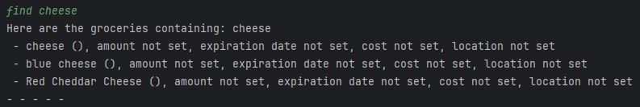
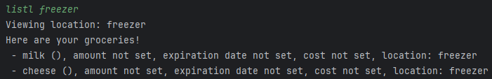

# User Guide to ***Grocery in Time***


## Introduction

Grocery in Time (GiT) is a **grocery tracker app**, optimised for use via a Command Line Interface (CLI).
It allows users to track and manage their groceries around their home easily.

&nbsp;
## Quick Start
1. Ensure that you have Java 11 or above installed.
2. Down the latest version of `Grocery in Time` from [here](https://github.com/AY2324S2-CS2113-T12-2/tp/releases).
3. Open a command terminal, `cd` into the folder where the JAR file is
   and use `java -jar Git.jar` to run Grocery in Time.

&nbsp;
## Features 

> #### Notes about the command format
> * Words in `UPPERCASE` are parameters to be supplied by the user.
> <br> e.g. In `find KEYWORD`, `KEYWORD` is a parameter to be supplied: `find cheese`.
> 
> 
> * Features requiring the `GROCERY` input are case-insensitive. 
> <br> e.g. `amt GROCERY a/AMOUNT` will set the amount of `milk` or `MILK`.

## Switching between different modes: `switch`
Switches between profile, calories, grocery or recipe mode.
GiT comes in different modes and will prompt the user to choose their desired mode.

Format: `switch`

* Enter the desired mode to switch to after inputting `switch`.

Example of usage:

`switch`


&nbsp;
## Grocery management mode

### Adding a new grocery: `add`
Adds a grocery and any desired additional details.

Format: `add GROCERY`

* `GROCERY` must be a valid String.
* After executing `add GROCERY`, GiT will ask if the user wishes to include additional details.
  * If so, the user has to enter the numbers corresponding to the details they wish to add.
  * Multiple numbers can be entered in any order and spaces between numbers are ignored.
  * Details are prompted for in the order their numbers are entered.
  * If `8` is entered, another menu explaining what each detail means will always be displayed first.
  * Invalid values are ignored.
  * This step can be skipped by inputting nothing.
* Any details not included here can be edited using other commands in the future.

Example of usage :
```
>> add milk

Before adding milk, do you want to include the following details?
1. Category
2. Amount
3. Location
4. Expiration Date
5. Cost
6. Threshold Amount
7. Remark
8. Help
Please enter the number of the details you want to include:
You may enter multiple numbers. (e.g. 1234)
To skip this step, do not enter any values.

>> 23

Including Amount
Please enter the amount (e.g. 3):

>> 5

Including Location
Please enter the location (e.g. freezer first compartment)

>> cabinet

cheese added!
- - - - -
```


&nbsp;
### Deleting a grocery: `del`
Delete a grocery.

Format: `del GROCERY`

Example of usage:

`del pork`


&nbsp;
### Setting the expiration date of a grocery: `exp`
Sets the expiration date of a grocery.

Format: `exp GROCERY d/EXPIRATION_DATE`

* `EXPIRATION_DATE` must be a in yyyy-MM-dd format.

Example of usage:

`exp milk d/2024-07-20`

&nbsp;
### Setting the amount of a grocery: `amt`
Sets the amount of a grocery.

Format: `amt GROCERY a/AMOUNT`

* `AMOUNT` must be a valid integer.

Example of usage:

`amt milk a/5`

&nbsp;
### Using a grocery: `use`
Reduce the amount of a grocery after using it.

Format: `use GROCERY a/AMOUNT`

* `AMOUNT` must be a valid integer.
* If `AMOUNT` is greater than what the `GROCERY` has in stock, its amount will be reduced to 0.
* If the amount of the `GROCERY` is already 0, GiT will let the user know and the amount stays at 0.

Example of usage:

`use meat a/4`

&nbsp;
### Setting the cost of a grocery: `cost`
Sets the cost of a grocery.

Format: `cost GROCERY  $PRICE`

* `PRICE` must be a valid numerical value.

Example of usage:

`cost milk $1.20`


&nbsp;
### Setting the threshold of a grocery: `th`
Sets the threshold amount of a grocery.  
The user should be reminded to top up the stock if amount falls below the threshold amount.

Format: `th GROCERY a/AMOUNT`

* `AMOUNT` must be a valid integer.

Example of usage:

`th milk a/1`


&nbsp;
### Viewing a list of groceries that are low in stock: `low`
Shows a list of groceries below the threshold amount.

Format: `low`

Example of usage:

`low`


&nbsp;
### Adding rating and review of a grocery: `rate`
Adds rating and review of an existing grocery

Format: `rate GROCERY`

Example of usage:

`rate milk`


&nbsp;
### Finding groceries: `find`
Find groceries containing a given keyword in their name.

Format: `find KEYWORD`

* The search is case-insensitive.
* If a phrase is passed, the entire phrase is searched for.

Example of usage:

`find cheese`




&nbsp;
### Adding a storage location: `loc`
Add a storage location to be tracked.

Format: `loc LOCATION`

Example of usage:

`loc freezer`


&nbsp;
### Storing a grocery in a storage location: `store`
Store a grocery in a given storage location.

Format: `store GROCERY l/LOCATION`

* `LOCATION` is case-insensitive. e.g. `freezer` matches `FREEZER`.
* If `LOCATION` does not exist, GiT will create the storage location and store the `GROCERY` there automatically.

Example of usage:

`store paprika l/spice rack`


&nbsp;
### Removing a storage location: `delloc`
Remove a storage location from tracking.

Format: `delloc LOCATION`

Example of usage:

`delloc cabinet`

&nbsp;
### Listing all groceries: `list`
Shows a list of all groceries you have.

Format: `list`

Example of usage:

`list`

&nbsp;
### Listing all groceries by price: `listcost`
Shows a list of all groceries you have, sorted by price.

Format: `listcost`

Example of usage:

`listcost`

&nbsp;
### Listing all groceries by expiration date: `listexp`
Shows a list of all groceries you have, sorted by expiration date.

Format: `listexp`

Example of usage:

`listexp`

&nbsp;
### Listing storage locations and their groceries: `listloc`
View all storage locations being tracked, or the groceries stored in a given location

Format: `listloc [LOCATION]`

* `LOCATION` is an optional parameter.
* Without `LOCATION`, all storage locations will be displayed.
* With `LOCATION`, all groceries in the given `LOCATION` will be displayed

Example of usage:

* `listloc`


* `listloc cubby`




&nbsp;
## Calories management mode

### Add eaten food: `eat`
Adds the food eaten and store its calories.

Format: `eat FOOD`

Example of usage:

`eat burger`

&nbsp;
### View all food and calories intake: `view`
Shows all the food consumed so far and their calories.

Format: `view`

Example of usage:

`view`

&nbsp;
## Profile management mode

### Update user information: `update`
Stores information needed to calculate and manage calories intake.

Format: `update`

Example of usage:

`update`

&nbsp;
### View user details: `view`
Shows the user profile details.

Format: `view`

Example of usage:

`view`

&nbsp;
## Recipe management mode

### Add new recipe: `add`
Adds new recipe, ingredient and steps.

Format: `add`

Example:
```
add

Please enter the title of the recipe:

Fried Egg

Please enter the ingredients for this recipe in one line:

egg,salt

Please enter the steps for this recipe in one line:

Fry the egg. Add salt. Serve.

Fried Egg added!
```

&nbsp;
### List all the recipes: `list`
Shows all the recipe titles.

Format: `list`

Example:
```
list

Here are your recipe titles!

1. fried egg
- - - - -
```

&nbsp;
### View a recipe: `view`
Shows the recipe ingredients and steps.

Format: `view` `RECIPE` 

Example:
```
view

Please enter the title of the recipe:

Fried Egg
```
&nbsp;
### Delete a recipe: `delete`
Shows the recipe ingredients and steps.

Format: `delete` `RECIPE`

Example:
```
delete

Please enter the title of the recipe:

Fried Egg

Fried Egg is removed from the recipe list.
```

## FAQ

**Q**: How do I transfer my data to another computer? 

**A**: {your answer here}

## Command Summary


| Command                                                        | Format and example                  |
|----------------------------------------------------------------|-------------------------------------|
| Add grocery                                                    | `add GROCERY`                       |
| Set grocery expiration date                                    | `exp GROCERY d/EXPIRATION_DATE`     |
| Set grocery amount                                             | `amt GROCERY a/AMOUNT`              |
| Set grocery cost                                               | `cost GROCERY $PRICE`               |
| Set grocery threshold amount                                   | `th GROCERY a/AMOUNT`               |
| View groceries that are low in stock                           | `low`                               |
| Use grocery                                                    | `use GROCERY a/AMOUNT`              | 
| Find groceries                                                 | `find KEYWORD`                      |
| Add storage location                                           | `loc LOCATION`                      |
| Rate and review groceries                                      | `rate GROCERY`                      |
| Store grocery                                                  | `store GROCERY l/LOCATION`          |
| View storage locations <br> View groceries in a given location | `listloc [LOCATION]`                |
| Remove storage location                                        | `delloc LOCATION`                   |
| List all groceries                                             | `list`                              |
| List all groceries by price                                    | `listcost`                          |
| List all groceries by expiration date                          | `listexp`                           |
| View all groceries expiring in the next 3 days                 | `expiring`                          |
| Switch between modes                                           | `switch`                            |
| Add food consumed                                              | `eat FOOD`                          |
| View consumed food and their calories                          | `view`                              |
| Update user information                                        | `update`                            |
| View user details                                              | `view`                              |
| Add recipe                                                     | `add` `TITLE` `INGREDIENTS` `STEPS` |
| List all recipes                                               | `list`                              |
| View recipe details                                            | `view` `TITLE`                      |
| Delete recipe                                                  | `delete` `TITLE`                    |