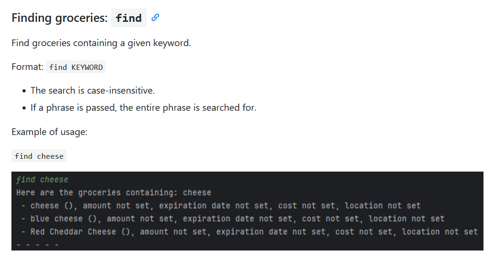
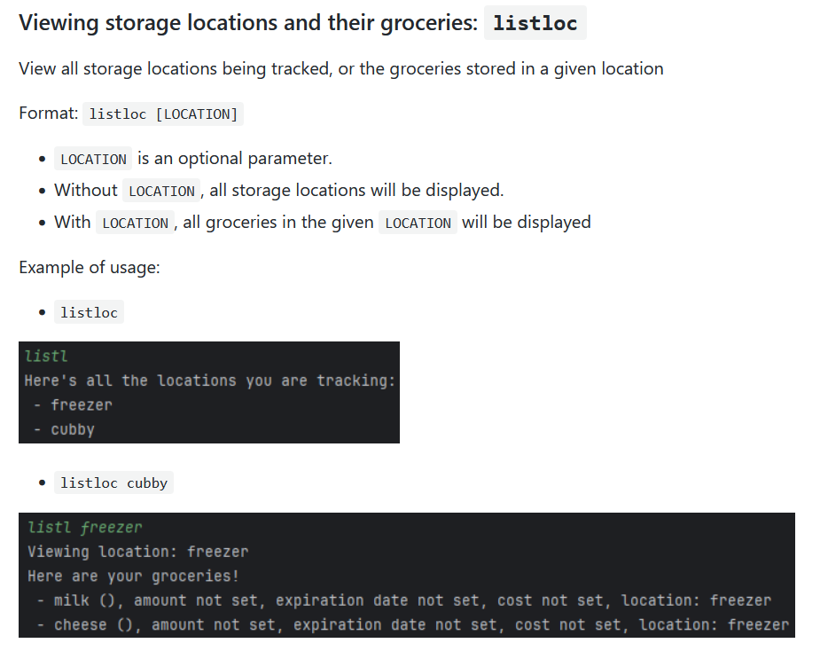
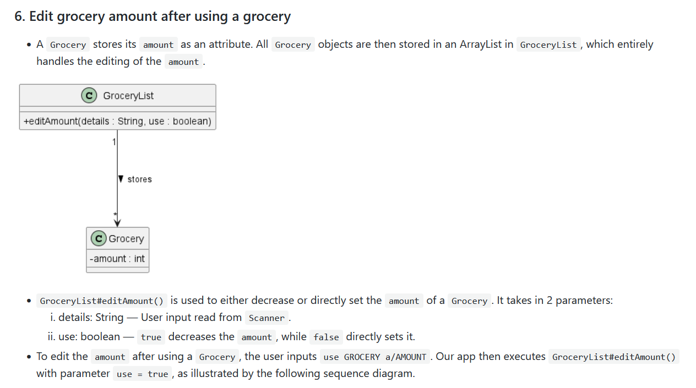
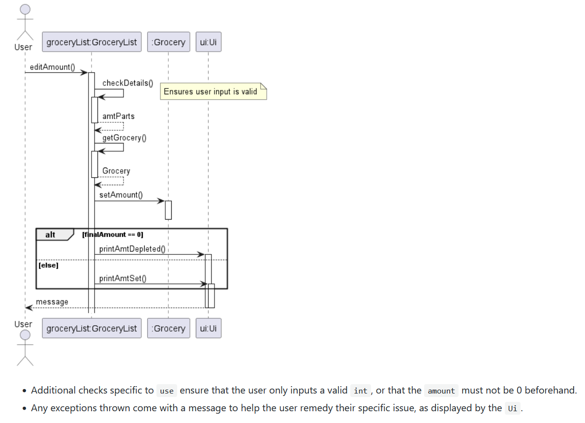

# Willson Han Zhekai - Project Portfolio Page

## Overview
Grocery in Time (GiT) is a **grocery tracker app**, optimised for use via a Command Line Interface (CLI).
It allows users to track and manage their groceries around their home easily.

## Summary of Contributions

### Code contributed
[RepoSense link of contributions](https://nus-cs2113-ay2324s2.github.io/tp-dashboard/?search=wallywallywally&breakdown=true&sort=groupTitle%20dsc&sortWithin=title&since=2024-02-23&timeframe=commit&mergegroup=&groupSelect=groupByRepos&checkedFileTypes=docs~functional-code~test-code&tabOpen=true&tabType=authorship&tabAuthor=wallywallywally&tabRepo=AY2324S2-CS2113-T12-2%2Ftp%5Bmaster%5D&authorshipIsMergeGroup=false&authorshipFileTypes=docs~functional-code~test-code&authorshipIsBinaryFileTypeChecked=false&authorshipIsIgnoredFilesChecked=false)

### Enhancements
1. Ability to **edit** the amount of a grocery
   - `amt GROCERY a/AMOUNT`: Set amount
   - `use GROCERY a/AMOUNT`: Decrease amount after using
2. Functionalities related to **storage locations**
   - `loc LOCATION`: Add location to be tracked
   - `delloc LOCATION`: Remove tracked location
   - `store GROCERY l/LOCATION`: Store grocery in a given location
   - `listloc [LOCATION]`
     - Without `LOCATION`: View all tracked locations
     - With `LOCATION` View groceries stored in given `LOCATION`
3. Ability to **find** groceries by name: 
   - `find KEYWORD`
4. Improved defensiveness through exception handling
   - Created custom exceptions with specific error messages for unexpected inputs

### Contributions to the User Guide
- Documentation for my enhancements
  - `amt`, `use`, `loc`, `delloc`, `store`, `listloc`, `find`
- General information
  - Introduction, Quick Start, Command Summary
- Enhancements to overall formatting and readability

### Contributions to the Developer Guide
- Design and implementation details
  - For features `amt` and `use`
  - Sequence diagram for `use`
  - Class diagram for `GroceryList`
- Product scope
  - Target user profile, Value proposition, User stories

### Contributions to Team-Based Tasks
- Set up GitHub organisation and repository
- General code enhancements regarding code readability, with a focus on exceptions
- Maintained issue tracker and milestones
  - Created and delegated issues
- Released v2.0

### Review/mentoring contributions
As shown in the following PRs: 
[#19](https://github.com/AY2324S2-CS2113-T12-2/tp/pull/19), 
[#52](https://github.com/AY2324S2-CS2113-T12-2/tp/pull/52),
[#89](https://github.com/AY2324S2-CS2113-T12-2/tp/pull/89),
[#151](https://github.com/AY2324S2-CS2113-T12-2/tp/pull/151)

### Contributions beyond the project team
[Reviewed another team's Developer Guide](https://github.com/nus-cs2113-AY2324S2/tp/pull/41)

## Examples of documentation contributions
[//]: # (to update)
### Extracts from the User Guide

## Extracts from the Developer Guide

